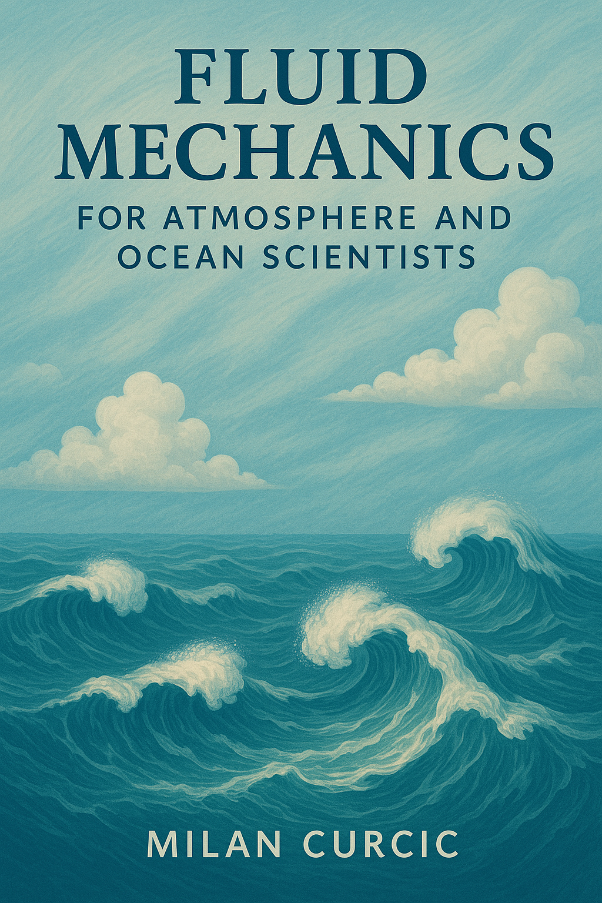

# fluid-mechanics-notes

Lecture notes for the Fluid Mechanics course (OCE 575/675) taught at the
Rosenstiel School.

Click on the cover to download the PDF:

See the [Syllabus](syllabus.md) for the Fall 2025 course information.

These notes are complete in scope but the content continues to improve.
Any feedback is welcome.
Figures are from Geoffrey Vallis's 2017 AOFD book and subject to his copyright.

All content in this repo is otherwise licensed under 
[CC BY-SA 4.0](https://creativecommons.org/licenses/by-sa/4.0/).
